# 🌿 Git Workflow Guide

This document describes the branching strategy and workflow for the Flask Learning Journey repository.

## Branch Strategy Overview

```mermaid
graph LR
    A[main] --> B[dev]
    B --> C[prod]
    C --> D[🚀 Deployment]
```



## Branch Descriptions

### 🌱 `main` Branch
- **Purpose**: Initial learning and development
- **Contains**: Learning commits, feature experiments, tutorials
- **Usage**: Your primary workspace for learning Flask concepts
- **Stability**: Work in progress

### 🔧 `dev` Branch  
- **Purpose**: Development integration and testing
- **Contains**: Merged features from main, integrated code
- **Usage**: Testing multiple features together
- **Stability**: Testing phase

### 🚀 `prod` Branch
- **Purpose**: Production-ready deployments
- **Contains**: Only stable, tested code
- **Usage**: Live website deployments
- **Stability**: Production ready

## Daily Workflow

### 1. Working on New Features (main)
```bash
# Start your day - make sure you're on main
git checkout main
git pull origin main

# Work on your learning/features
# ... make changes to files ...

# Commit your work
git add .
git commit -m "feat: add authentication learning module"
git push origin main
```

### 2. Moving to Development (main → dev)
```bash
# Switch to dev branch
git checkout dev
git pull origin dev

# Merge your work from main
git merge main

# Push to dev for testing
git push origin dev

# Switch back to main for continued work
git checkout main
```

### 3. Deploying to Production (dev → prod)
```bash
# Only when features are tested and stable
git checkout prod
git pull origin prod

# Merge from dev
git merge dev

# Push to production (triggers deployment)
git push origin prod

# Switch back to main
git checkout main
```

## Commit Message Conventions

Follow conventional commits for better tracking:

- `feat:` - New features or learning modules
- `fix:` - Bug fixes
- `docs:` - Documentation updates  
- `style:` - Code formatting
- `refactor:` - Code restructuring
- `test:` - Adding tests
- `chore:` - Maintenance tasks
- `deploy:` - Deployment related

### Examples:
```bash
git commit -m "feat: add user authentication with Flask-Login"
git commit -m "docs: update README with JWT authentication guide"  
git commit -m "fix: resolve database connection timeout issue"
git commit -m "deploy: update production environment variables"
```

## Branch Protection Best Practices

### For Learning (Current Setup):
- `main`: Open for direct commits (learning phase)
- `dev`: Merge from main when ready to test
- `prod`: Merge from dev when ready to deploy

### For Team Projects (Future):
- Use Pull Requests for all merges
- Require code reviews
- Run automated tests
- Protect prod branch from direct pushes

## Quick Reference Commands

```bash
# View all branches
git branch -a

# Check current branch
git branch

# Switch branches
git checkout main
git checkout dev  
git checkout prod

# Create and switch to new branch
git checkout -b feature/new-learning

# Merge branches
git merge source-branch

# View commit history
git log --oneline --graph --all

# Check working directory status
git status
```

## Deployment Triggers

- **`prod` branch updates** → Automatic deployment to live site
- **`dev` branch updates** → Can trigger staging deployments (optional)
- **`main` branch updates** → No automatic deployment

## Emergency Procedures

### Hotfix for Production:
```bash
# Create hotfix branch from prod
git checkout prod
git checkout -b hotfix/critical-bug

# Make your fix
# ... fix the issue ...

# Commit and merge back
git add .
git commit -m "fix: resolve critical security vulnerability"
git checkout prod
git merge hotfix/critical-bug
git push origin prod

# Also merge back to dev and main
git checkout dev
git merge prod
git push origin dev

git checkout main  
git merge dev
git push origin main

# Delete hotfix branch
git branch -d hotfix/critical-bug
```

### Rolling Back Production:
```bash
# Find the last good commit
git log --oneline

# Reset to previous commit (replace HASH with actual commit hash)
git checkout prod
git reset --hard COMMIT_HASH
git push --force-with-lease origin prod
```

---

## 🎯 Summary

This workflow ensures:
- ✅ Safe experimentation on `main`  
- ✅ Integration testing on `dev`
- ✅ Stable production deployments on `prod`
- ✅ Clear history of your learning journey
- ✅ Professional development practices
